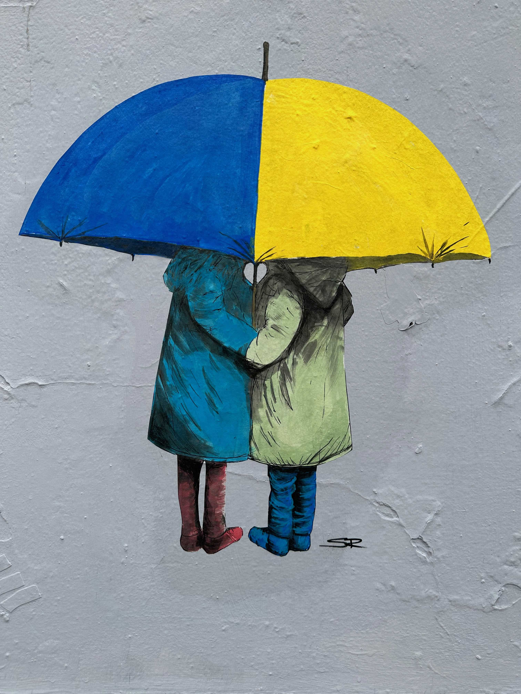
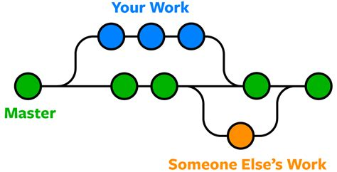
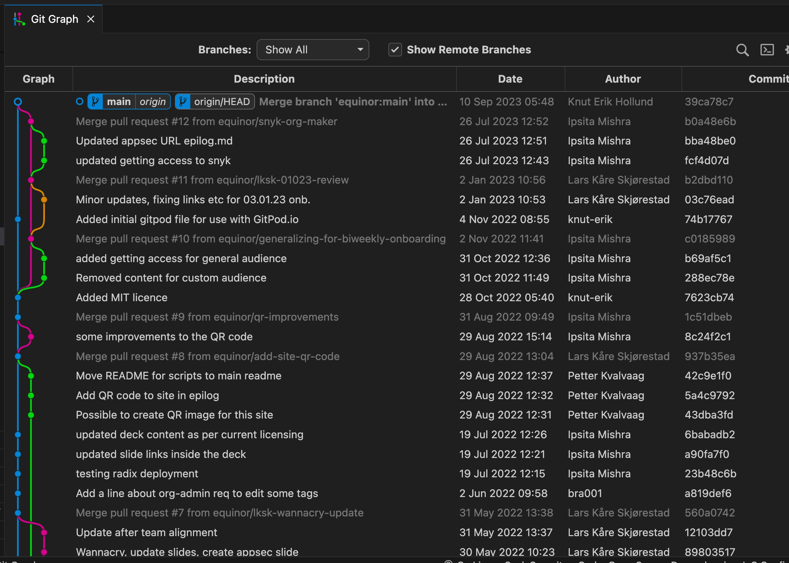

<!-- _class: lead -->

# Collaboration
###### `Git and GitHub - 101`

---
## `git`

* `git` is a program / a binary
* Initial creator - Linus Torvalds
* Development 
  * Sunday 3rd April 2005
  * Self-hosted Thursday 7th April 2005
* Distributed version control system

---
## `GitHub`

* Collaboration space - host for git controlled files
* Added features such as
  * Issue tracking, projects, pull requests, comments, reviews etc
* Aquired by Microsoft for 7.5B USD in 2018
* Defacto place where open source repositories are stored

---
## Language of Git / GitHub

- `Repository` - a _catalogue_ of files and folders
- `Clone` - Clone a repository to local device
- `Pull ⬇` - pull latest files from repository to your local device
- `Push️ ️️️⬆️`️ - pushing local changes to repository
- `Merge ⛙` - merge changes from one branch to another

---

# Git branch - example

---

---

# Credits

- Street art from various artists - Pixabay - https://pixabay.com/
- Git logo from official Git site - https://git-scm.com/downloads/logos
- GitHub logo from official GitHub site - https://github.com/logos
