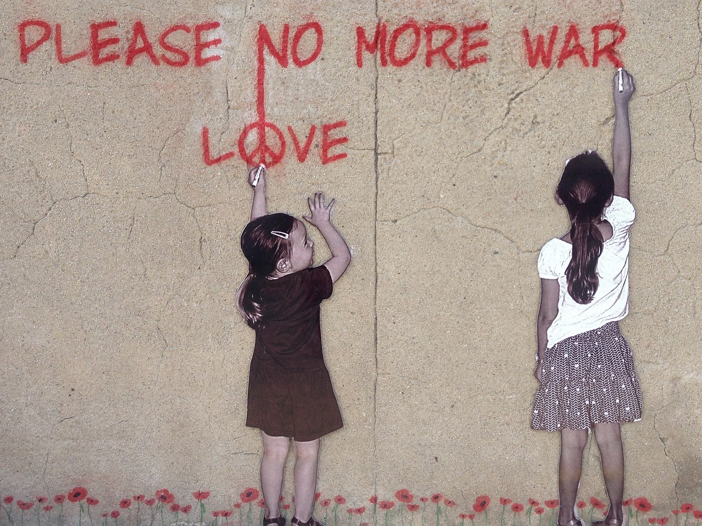

<!-- _class: lead -->

# Collaboration and `pure` text files
###### `Git and GitHub - 101`

---

## `git`

* `git` is a program/binary
* Distributed version control system
* Start Sunday 3rd April 2005
* Self-hosted Thursday 7th April 2005

---

## `GitHub`

* Collaboration space - a hub for git hosted files
* Adding features such as issues, projects, pull requests etc
* Bought by Microsoft for 80Mill$ in 20xx
* Defacto place where open source repositories are stored
* Free as in Gratis to use for open source projects

---
