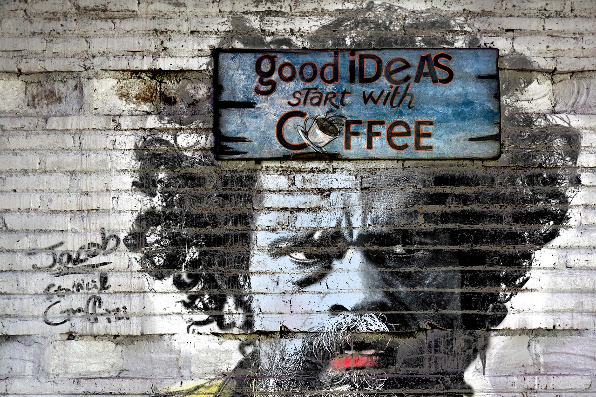
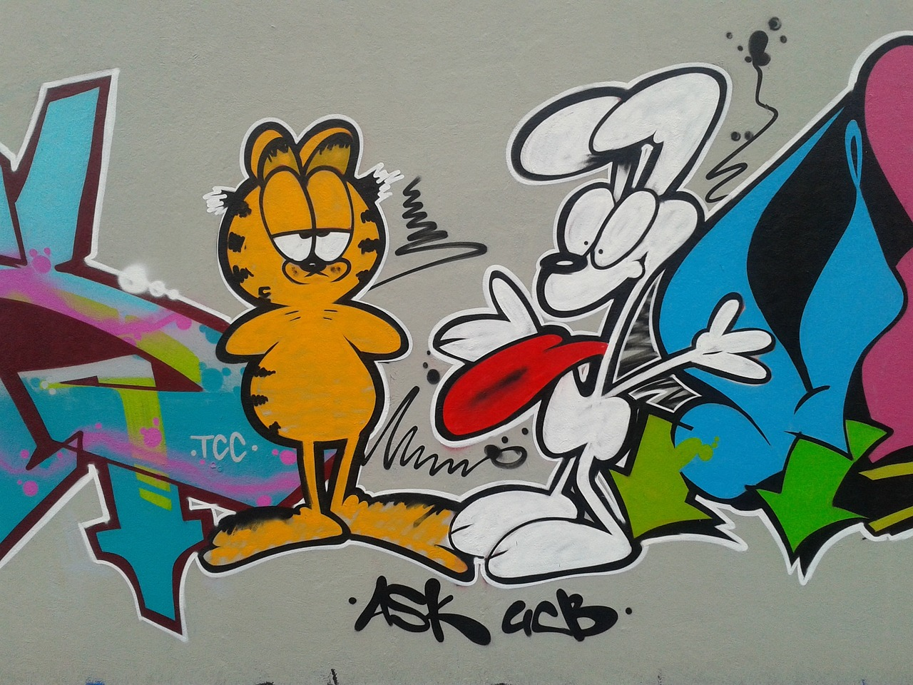

<!-- _class: lead -->

# Always ready to code!
###### `CDE - Cloud Development Environment`
>Treat your infrastructure as cattle 🐮, not pets 🦮

---

> I think the shift to the cloud will happen at such a rapid rate, that in a few years, I predict there will be no more source code on your computers.  

Thomas Dohmke (2022), CEO GitHub

---

## Learning objectives 👩🏽‍🏫

* 👨🏼‍💻 Awaken curiousity for a better way of maintaining dev environments
* 😈 Provoke us to transform 🧙🏼‍♂️ our pets 🦮 to cattles 🐮
* 👩🏽‍💻 Demo CDE - _ready to code_ from zero to fully operative
* 🤩 Inspire to explore
  - `Developer eXperince` / `Cloud Development Environment`

---

# DevX - Developer eXperience
  

>Developer experience refers to how easy or difficult it is for a developer to perform essential tasks needed to implement a change.   A positive developer experience would mean these tasks are relatively easy for the team.

---

# Cloud happened

* Virtual Machines - gained momentum late 90-ties
* Transformation to Cloud computing - (AWS 2006)
* Containerisation - Docker / Kubernetes - (2014)
* Ephemeral workspaces or CDEs - Now!

---

# What is CDE
  

>Cloud development environments are on-demand and pre-configured with all tools, libraries and dependencies required to be ready-to-code.

---

# Cloud Development Enivronments - principles

* **Ephemeral** over _long lived_
  - A fresh disposable environment for every task
* **Reproducible** over _cobbled together_
  - Consistently replicable without manual intervention
* **Effortless** over _arduous_
  - With minimal friction and difficulty

---

# Vision
 
From :

Select project, check dependencies, checkout branch, view readme.txt, install tools, run build, run test, start coding.

---

# Vision
 
To :

Select project,
~~check dependencies, checkout branch, view readme.txt, install tools, run build, run test,~~
start coding.

---

<!-- _class: lead -->
# DEMO

gitpod.io CDE - Cloud Development Environment
 
"Pod's = containers" hosted on a Kubernetes environment